# Minisora与Sora复现最新进展

<!-- PROJECT SHIELDS -->

[![Contributors][contributors-shield]][contributors-url]
[![Forks][forks-shield]][forks-url]
[![Issues][issues-shield]][issues-url]
[![MIT License][license-shield]][license-url]
[![Stargazers][stars-shield]][stars-url]
 

<!-- PROJECT LOGO -->

  
&nbsp;

  

[English](README.md) | 简体中文

如果您有兴趣加入我们的Sora综述论文团队，请在Issue和PR留下您的信息。我们将尽快回复您的问题。

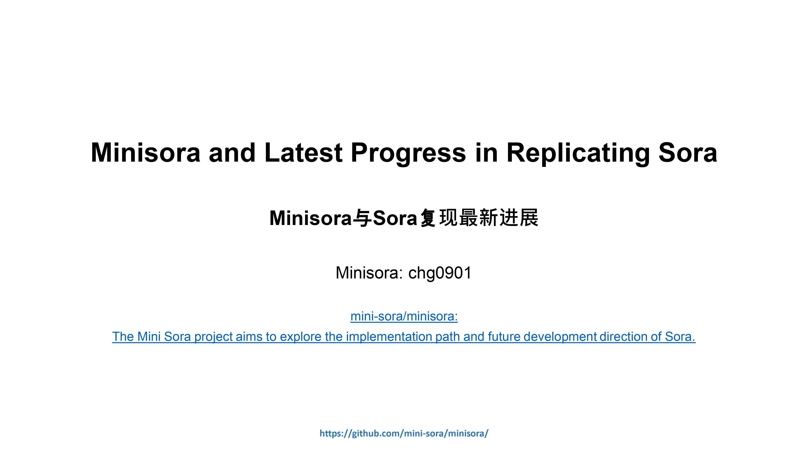
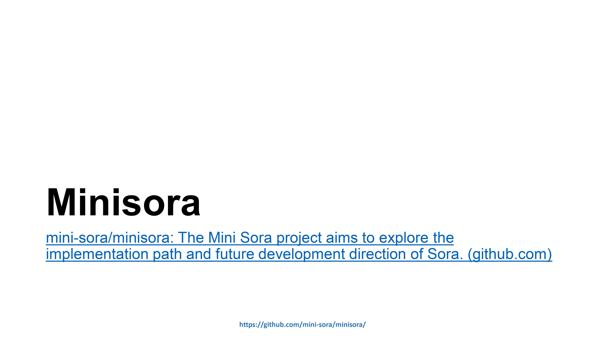
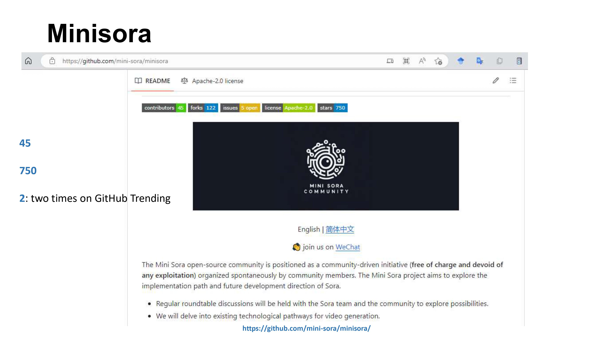
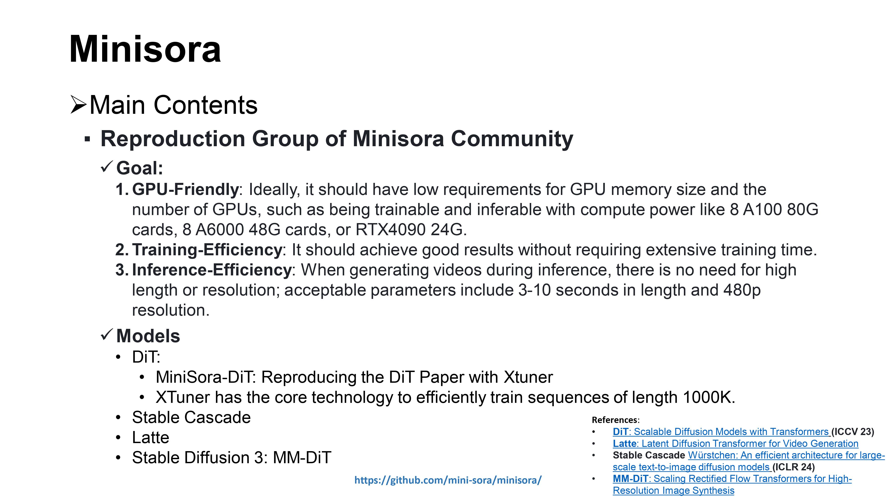
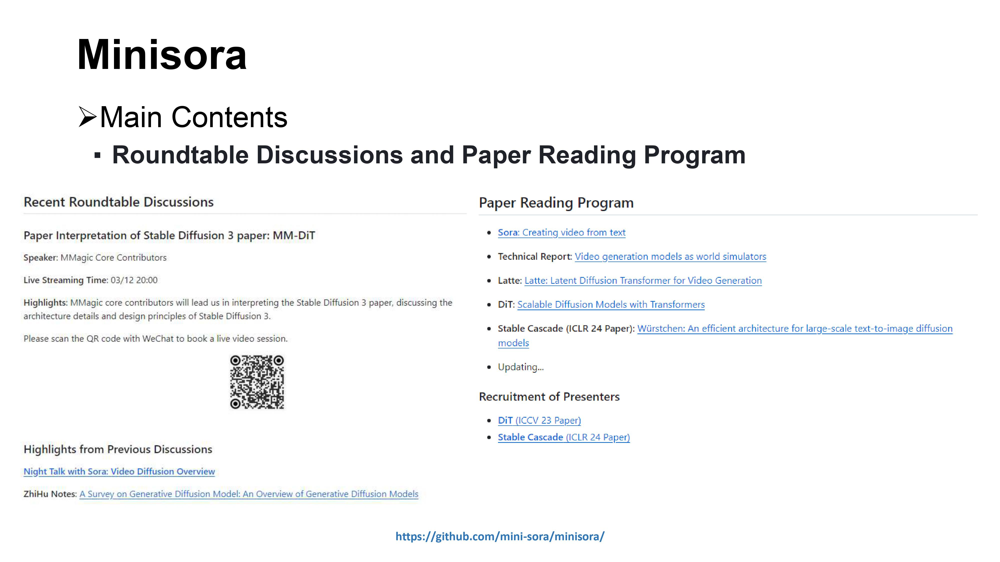
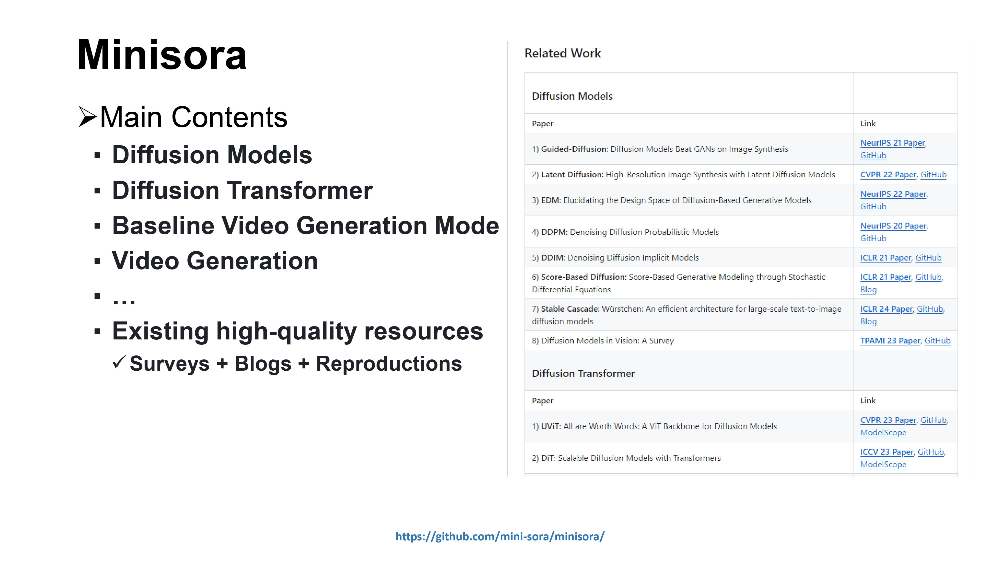
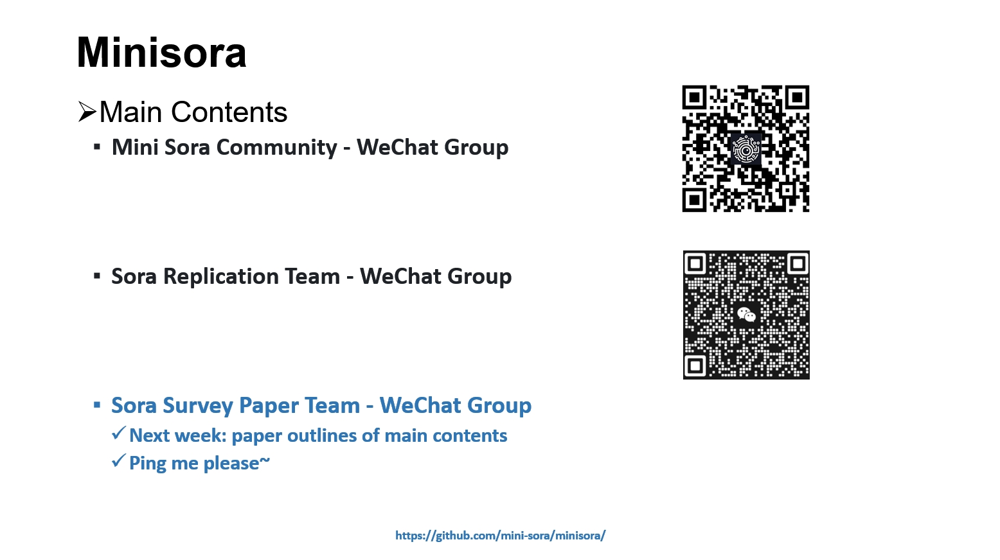
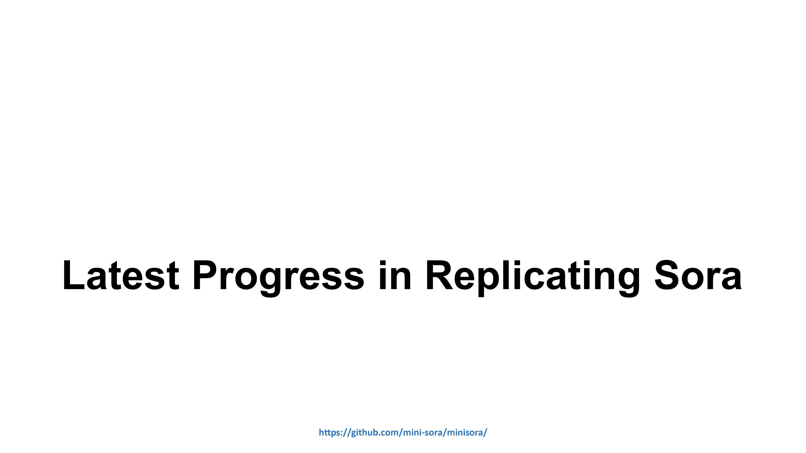
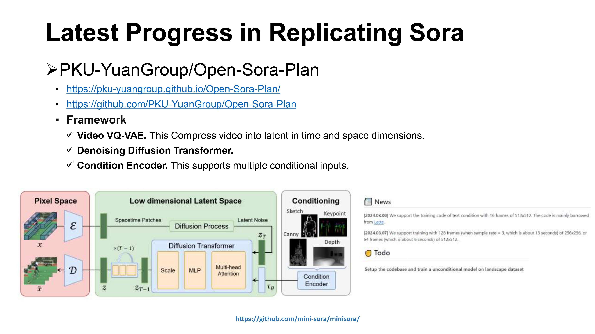

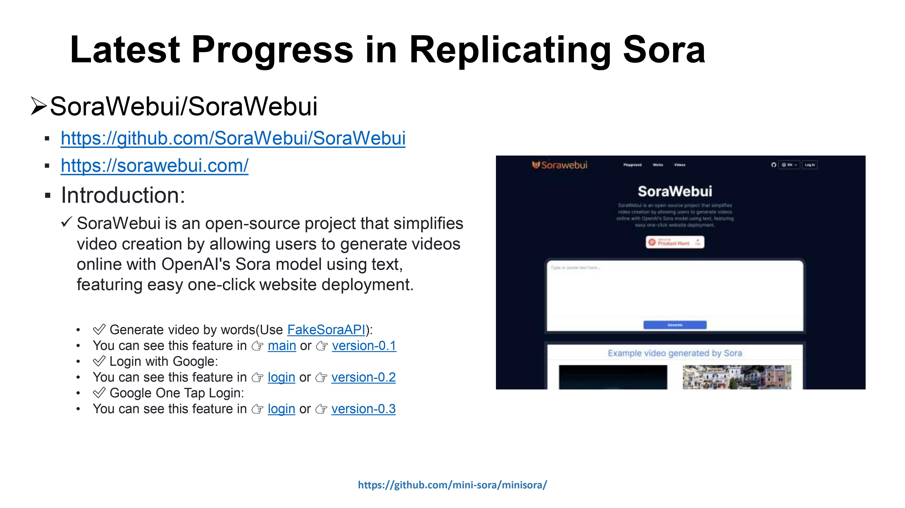
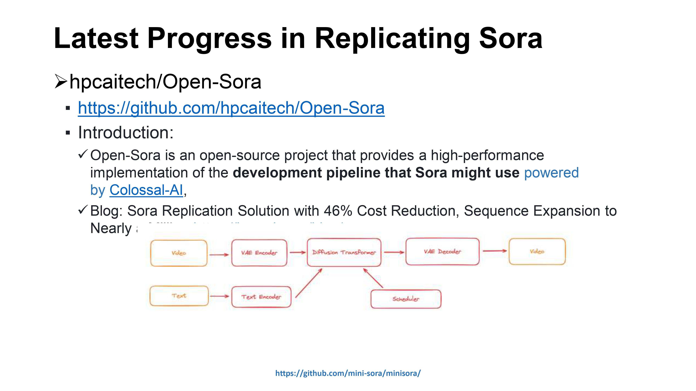
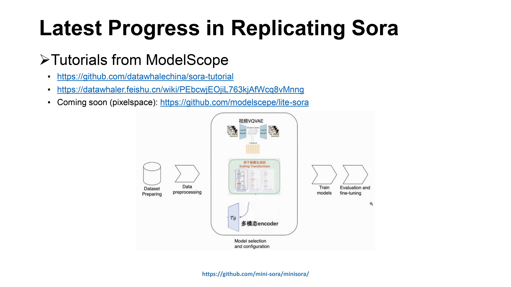
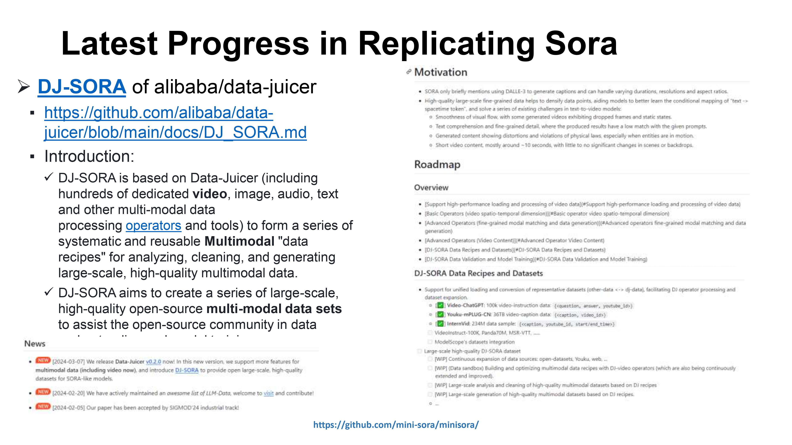

[your-project-path]: mini-sora/minisora
[contributors-shield]: https://img.shields.io/github/contributors/mini-sora/minisora.svg?style=flat-square
[contributors-url]: https://github.com/mini-sora/minisora/graphs/contributors
[forks-shield]: https://img.shields.io/github/forks/mini-sora/minisora.svg?style=flat-square
[forks-url]: https://github.com/mini-sora/minisora/network/members
[stars-shield]: https://img.shields.io/github/stars/mini-sora/minisora.svg?style=flat-square
[stars-url]: https://github.com/mini-sora/minisora/stargazers
[issues-shield]: https://img.shields.io/github/issues/mini-sora/minisora.svg?style=flat-square
[issues-url]: https://img.shields.io/github/issues/mini-sora/minisora.svg
[license-shield]: https://img.shields.io/github/license/mini-sora/minisora.svg?style=flat-square
[license-url]: https://github.com/mini-sora/minisora/blob/main/LICENSE
